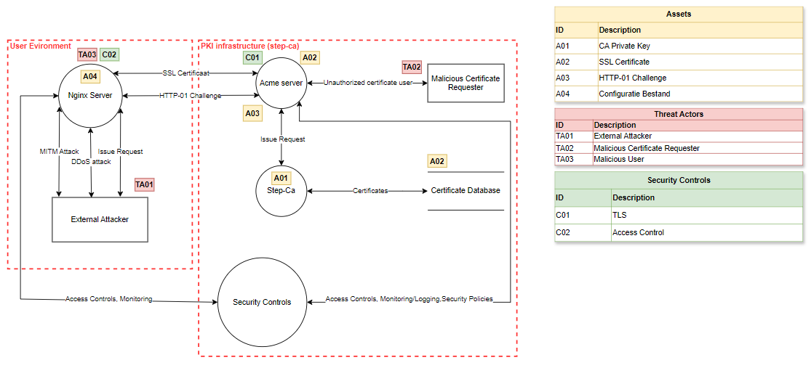
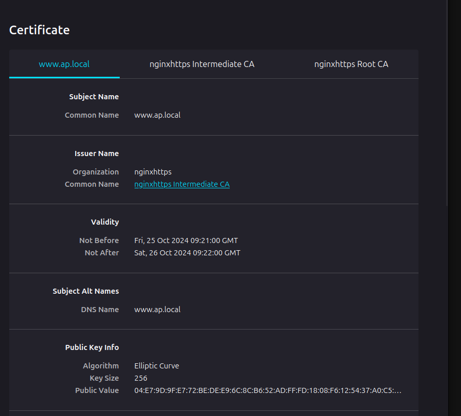

# Verslag Cyber Security Advanced

#### Groepsleden

- Oscar Alexander
- Laurence Leysen
- Lorik Qerkezi
- Stanley Okomhen
  <br>

## Threat Model



## Step-ca opzetten

Hieronder korte stappen en uitleg van hoe we de step-ca hebben opgezet.

##### Stap 1

Installeer eerst step CLI en step-ca (ubuntu/debian), voer onderstaande commandos uit:
`wget https://dl.smallstep.com/cli/docs-cli-install/latest/step-cli_amd64.deb`
`sudo dpkg -i step-cli_amd64.deb`
`wget https://dl.smallstep.com/certificates/docs-ca-install/latest/step-ca_amd64.deb`
`sudo dpkg -i step-ca_amd64.deb`

##### Stap 2

Na de installatie van de Step CLI kunnen we de certificaatinstantie initialiseren:
`step ca init`
`✔ Deployment Type: Standalone`
`What would you like to name your new PKI?`
`✔ (e.g. Smallstep): nginxhttps`
`What DNS names or IP addresses will clients use to reach your CA?`
`✔ (e.g. ca.example.com[,10.1.2.3,etc.]): 127.0.0.1`
`What IP and port will your new CA bind to? (:443 will bind to 0.0.0.0:443)`
`✔ (e.g. :443 or 127.0.0.1:443): 127.0.0.1:8443`
`What would you like to name the CA's first provisioner?`
`✔ (e.g. you@smallstep.com): cyberadvlauosclor@cyber.be`

##### Stap 3

In deze stap passen we de CA-configuratie aan, zodat uitsluitend certificaten voor .be- en .local-domeinen worden uitgegeven.

```{
  "authority": {
    "policies": {
      "x509": {
        "allowedNames": ["*.be", "*.local"]
      }
    },
    "acme": {
      "enabled": true,
      "challenge": {
        "http": true,
        "dns": false,
        "tls": false
      }
    }
  }
}
```

##### Stap 4

Start de CA-server en Nginx door de volgende commando's uit te voeren:
`step-ca $(step path)/config/ca.json`

##### Stap 5

We configureren Nginx om op poort 80 te luisteren. Certbot vereist toegang via deze poort om een certificaat aan te vragen. Daarna moet Nginx opgestart worden.

Pas het configuratiebestand van Nginx aan met het volgende:

```
server {
    listen 80;
    server_name ap.local;

    ssl_protocols TLSv1.2 TLSv1.3;
    ssl_ciphers HIGH:!aNULL:!MD5;

    ssl_stapling on;
    ssl_stapling_verify on;

    root /var/www/html;
    index index.html;

    gzip off;
}
```

##### Stap 6

Gebruik het volgende Certbot-commando om een certificaat aan te vragen. De respons die Certbot teruggeeft, heb je nodig in stap 7.
`sudo certbot -v certonly --manual --preferred-challenges http   --server https://localhost:8443/acme/acme/directory   -d ap.local`

##### Stap 7

Met de informatie die Certbot teruggeeft, maak je een bestand aan in de acme-challenge map. Let op: Als je een foutmelding krijgt vanwege onvoldoende rechten, geef dan de juiste permissies aan de map.

##### Stap 8

Herstart Nginx zodat de ACME-challenge kan worden voltooid:
`sudo systemctl restart nginx`

##### Stap 9

Nu Nginx correct is ingesteld, kun je het configureren voor SSL-verkeer. We passen de configuratie aan om SSL op poort 443 te ondersteunen en geven het pad naar het certificaat op.

Gebruik de volgende configuratie in het Nginx-configuratiebestand:

```
server {
    listen 443 ssl;
    server_name ap.local;

    ssl_certificate /etc/letsencrypt/live/ap.local-0002/fullchain.pem;
    ssl_certificate_key /etc/letsencrypt/live/ap.local-0002/privkey.pem;

    add_header Strict-Transport-Security "max-age=31536000; includeSubDomains; preload";

    ssl_protocols TLSv1.2 TLSv1.3;
    ssl_ciphers HIGH:!aNULL:!MD5;

    ssl_stapling on;
    ssl_stapling_verify on;

    root /var/www/html;
    index index.html;

    gzip off;
}
```

##### Stap 10

Open nu je browser en navigeer naar je Nginx-site. Als de site nog steeds wordt gemarkeerd als onveilig, kan dit komen doordat het certificaat niet wordt herkend.

Om dit op te lossen:

1. Voer volgende commandos uit om de certificaten te vernieuwen

```
sudo cp ~/.step/certs/root_ca.crt /usr/local/share/ca-certificates/
sudo update-ca-certificates
```

2. Zet het aangemaakte certificaat in de root-certificaatmap van je systeem.
3. Als dit niet werkt (vooral bij Ubuntu), importeer dan het certificaat rechtstreeks in de browser.

## Enkel voor .be en .local certificaten zorgen

Om deze requirment te voldoen moesten we beperkingen leggen op de CA-server. We kunnen dit door de step-ca file aan te passen. De configuratie hebben we hebben ingesteld.

Dit stelt een provisioner met ACME type, dit is ook nodig bij de volgende opdracht om HTTP-01 in te stellen. Herstart ook zeker de CS-server na de configuratie aan te passen.

## Wat is ACME

ACME (Automatic Certificate Management Environment) is een protocol dat is gemaakt om certificaten automatisch te beheren. Het is ontwikkeld door dezelfde organisatie die Let's Encrypt beheert. ACME vereenvoudigt het krijgen van SSL/TLS certificaten door het automatiseren hiervan.

## Wat is HTTP-01

De HTTP-01-challenge is een door ACME gebruikte validatiemethode om eigenaarschap over een domein te verifiëren. Bij de HTTP-01 moet de server aantonen dat deze eigendom heeft waarvoor een certificaat wordt aangevraagd. Het proces loopt zo:

1. De ACME geeft een unieke token door aan de server die het certificaat aanvraagt.
2. De server plaatst dit token op een specfieke URL in het domein.
3. De ACME server probeert de token via een GET methode te bereiken om er van zeker te zijn dat de server controle heeft over dat domein.

#### Hoe hebben we deze ondersteund

We hebben dit gedaan in stap 8. Dit voert de HTTP-01 challenge uit.

## Hoe we de CA keys beveiligen

De belangrijkste maatregelen die we nemen, zijn:

1. Encryptie van de private key: de private key van de CA wordt altijd geëncrypteerd opgeslagen. Dit zorgt ervoor dat zelfs als een aanvaller fysieke toegang krijgt tot de bestandssystemen de sleutel zelf niet bruikbaar is zonder decryptie.
2. Beperkte toegang: alleen geautoriseerde gebruikers hebben toegang tot de private key. Toegangsrechten worden strikt beperkt en zorgvuldig gecontroleerd.
3. Fysieke isolatie: voor extra veiligheid wordt de private key opgeslagen op een aparte geïsoleerde machine.
4. TPM chip: zorgt voor volledige hardware encryptie. De TPM chip geeft een extra beveiliging door cryptografische sleutels veilig te genereren en op te slaan waardoor gevoelige data zoals de private key nog beter beschermd is tegen ongewenst toegang.

## Nginx Server opzetten

- apt-install nginx
- Configuratie aanpassen zoals in de bovenstaande stappen staat beschreven.

## Screenshots vanuit de browser



## Output van testssl.sh


## Video

https://youtu.be/yKVcZUss4q4
